# SDF Generator for Unreal Engine
UE上で入力画像からSDF画像を生成する機能を中心とした, 幾つかのツール群のリポジトリです.

## 概要
- [SDF生成ツール](#anchor_SdfGenerateTool)
  - EUW_GenerateSDF
  - 任意の画像からSDF画像を生成する Editor Utility Widget ツールです.
- [ShadowThresholdMap生成ツール](#anchor_ShadowThresholdMapGenerateTool)
  - EUW_GenerateShadowThresholdMap
  - 白領域が徐々に広がるような連番画像を, SDFベースで補間して1枚のグラデーション画像(Shadow Threshold Map)を生成します.
  - Toonレンダリングの顔の陰制御などに利用される Face Threshold Map 等とも呼称されるものなります.

# SDF生成ツール
EUW_GenerateSDF というEditor Utility Widgetがツール本体です.

SDF計算自体はUEマテリアルを利用して Jump Flooding アルゴリズムをGPUで実行しています.

### 使い方
Editor Utility Widget である EUW_GenerateSDF をコンテキストメニューから実行

Src Texture 2D に入力となるTexture2Dを指定.

Dst Render Target に結果のSDFを出力するTexture Render Target 2Dを指定.

Generateボタンを押すとSDFが計算されます.

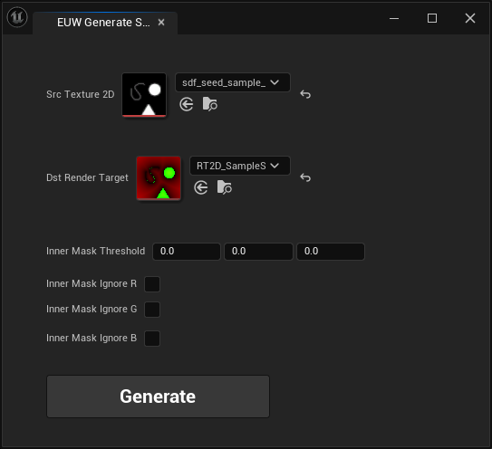

#### その他機能
- Inner Mask Threshold
  - 入力画像から内部/外部マスクを生成する際のComponent毎の閾値を指定.
  - それぞれのComponentがこの数値よりも大きい場合に内部テクセルとして扱われる.
    - 例: {0.5, 0.1, 0.1} -> 「Rチャンネルが0.5より大きい」「Gチャンネルが0.1より大きい」「Bチャンネルが0.1より大きい」 の何れかを満たすテクセルは内部テクセルとして処理される.
- Inner Mask Ignore R
  - 入力画像から内部/外部マスクを生成する際に指定したComponentを無視する.
  - Trueの場合Rチャンネルに関して内部/外部判定から除外する.
- Inner Mask Ignore G
  - 同上. Gチャンネルを無視する.
- Inner Mask Ignore B
  - 同上. Bチャンネルを無視する.

### 入力データ
入力テクスチャにはSDFの計算元として使いたい画像を指定します.

入力テクスチャは内部で二値化され, 白領域が内側, 黒領域が外側としてSDFが計算されます.

SDFの元としての二値化は, Inner Mask Threshold や Inner Mask Ignore R 等の設定を元に決定されます.
デフォルトでは完全な黒が外部, そうでない場所が内部という扱いでSDFが計算されます.

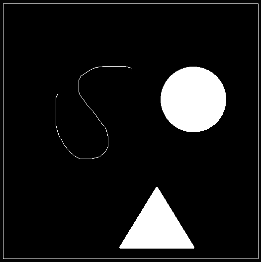

### 出力データ
Texture Render Target 2D を指定します.

フォーマットはRGコンポーネントがあり, float形式のものを要求します.

例: RGBA16F

結果のSDFは

- Rチャンネル : 幅と高さの大きい方で正規化された距離

- Gチャンネル : 内部テクセルの場合に非ゼロ

となります.

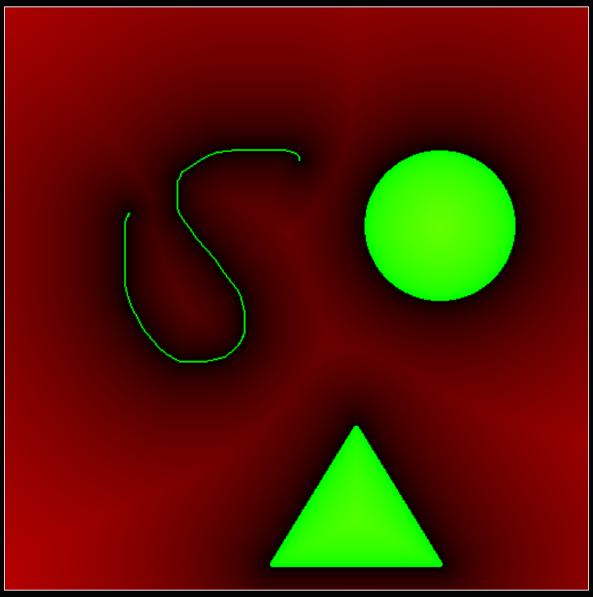
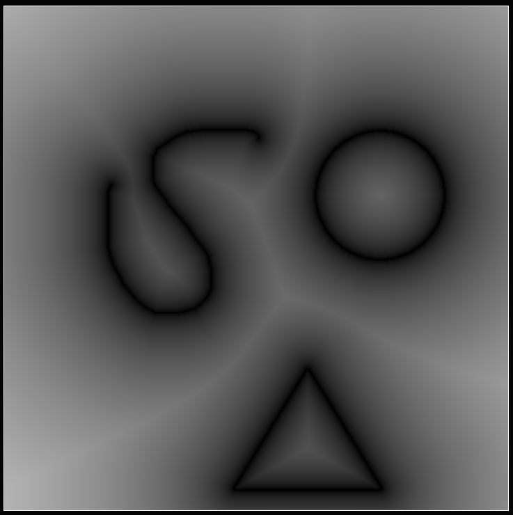
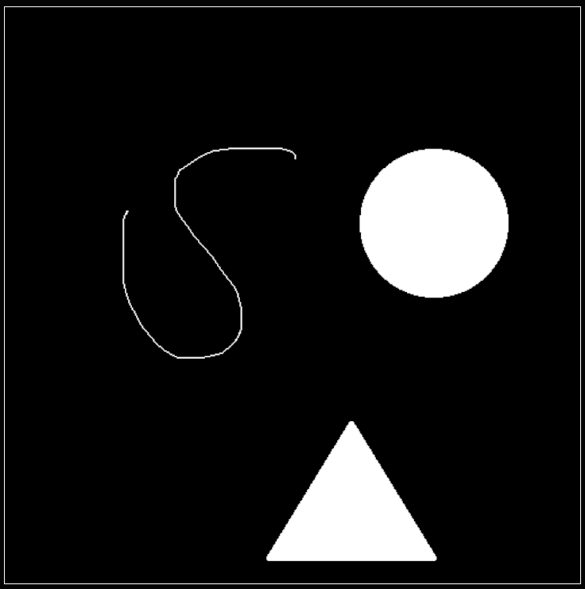

### SDFテクスチャの保存
Render Target 2Dは上書きされてしまうため右クリックから

「スタティックテクスチャを作成」

で保存することをおすすめします.

### Implementation Detail
Jump FloodingをUEマテリアルで実装することでGPU実行による高速化を意図しています.

マテリアルは M_JumpFlood_Itr_Signed 等が該当します.

Jump Floodingのセットアップや反復処理は BPFL_GenerateSDF に実装されています.

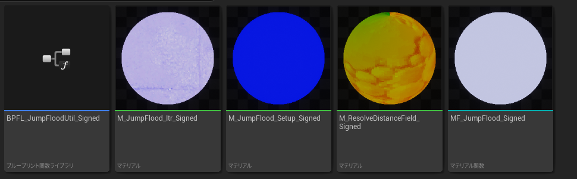

 

# ShadowThresholdMap生成ツール
EUW_GenerateShadowThresholdMap というEditor Utility Widgetがツール本体です.

白い領域が徐々に広がるような連番画像を入力として, SDFを利用した補間によって1枚のグラデーション画像を生成します.

このグラデーション画像は "Shadow Threshold Map" や "Face Threshold Map" 等とも呼ばれ, 
Toonレンダリングでのキャラクターの顔の陰制御などに用いられることもあります.

参考) Hi-Fi RUSH https://cgworld.jp/article/202306-hifirush01.html

### 使い方
EUW_GenerateShadowThresholdMap をコンテキストメニューから実行

AddボタンとRemoveボタンによって入力連番テクスチャ項目を追加削除できます.

Target Texture 2D に結果のThreshold Mapを出力するTexture Render Target 2Dを指定します.

Generateボタンを押すとSDFが計算されます.

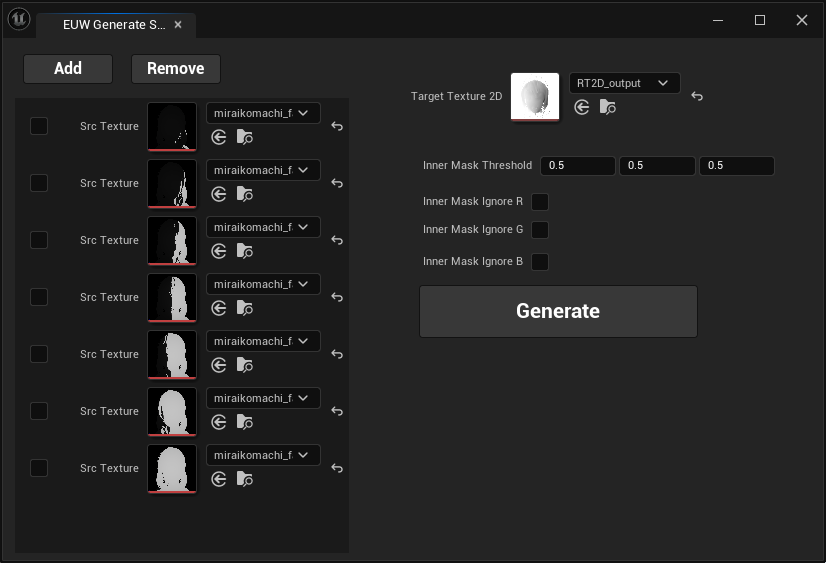

#### その他機能
- Inner Mask Threshold
  - SDF生成ツールとおなじ.
- Inner Mask Ignore R
  - SDF生成ツールとおなじ.
- Inner Mask Ignore G
  - SDF生成ツールとおなじ.
- Inner Mask Ignore B
  - SDF生成ツールとおなじ.

### 入力データ
リストに上から下の順で入力連番画像を設定します.

基本的には二値画像で, 白い領域が徐々に広がっていくような連番画像を要求します.

連番画像のシーケンス中でのテクセルの黒/白の変化は非可逆で, 一度白領域になったテクセルが再び黒領域になるような変化は無視されます.

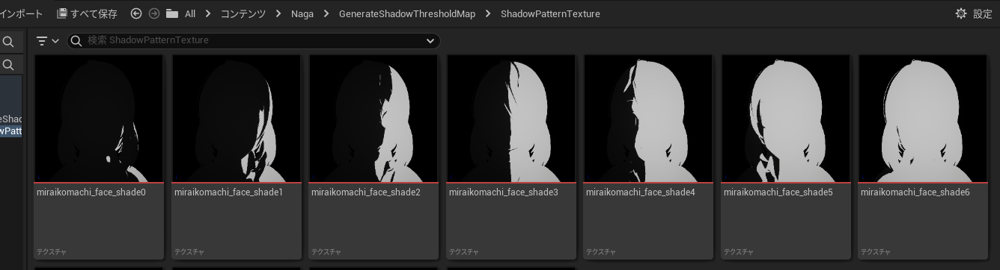

### 出力データ
Texture Render Target 2D を指定します.

入力連番画像の各時点での領域を経由しつつ, SDFベース補間で滑らかに領域が遷移するグラデーション画像が出力されます.

この画像に対して閾値で二値化をすることで連番画像を滑らかに繋いだような黒白領域変化を表現できます.

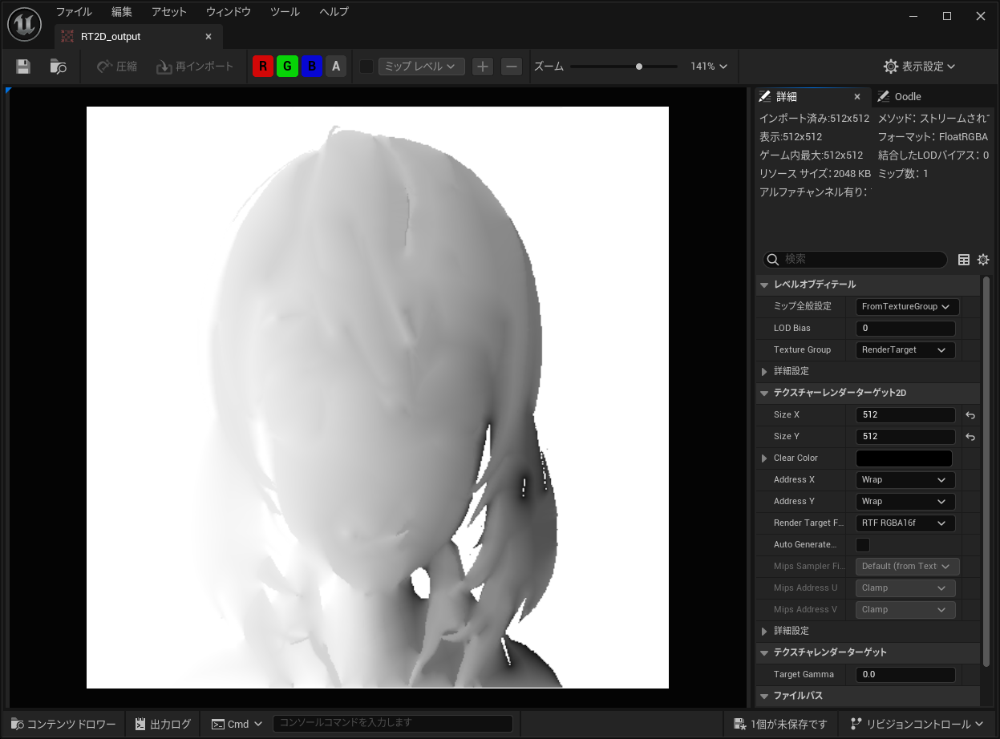
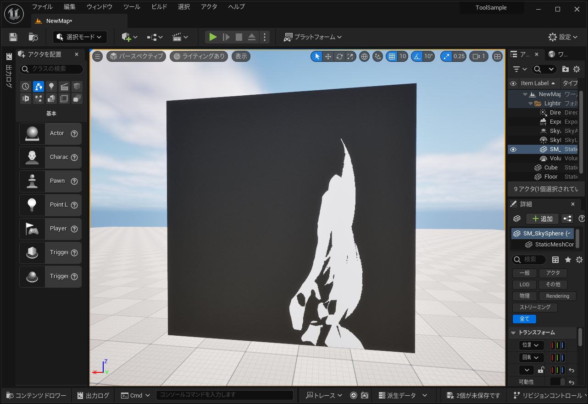
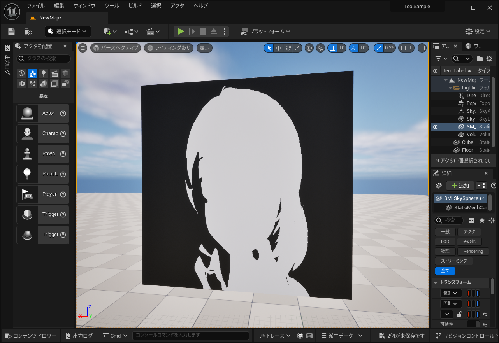

### Implementation Detail
書き途中!!

